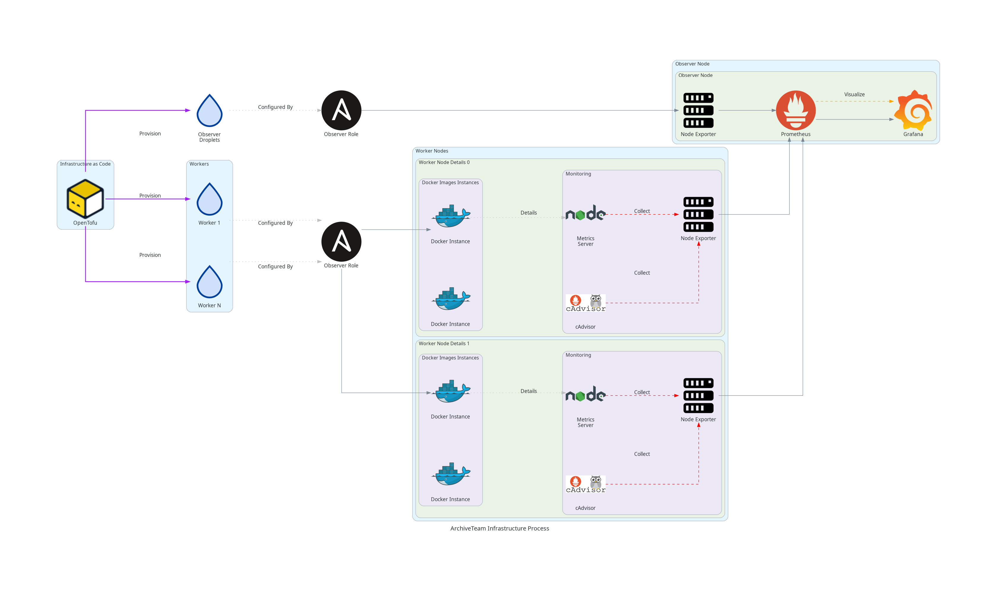

# ArchiveTeam Infrastructure

This repository contains the infrastructure code for deploying and managing ArchiveTeam Warrior instances along with their monitoring infrastructure. The codebase is primarily built using Terraform for infrastructure provisioning and Ansible for configuration management.

## High-Level Summary

This codebase provides a complete infrastructure-as-code solution for deploying, managing, and monitoring Docker containers on Digital ocean servers at scale. The result is a modular monitoring stack that supports multiple observer and target nodes, each capable of hosting multiple concurently running docker containers. It is designed to run Archive team scropts in particualar, but can easily be configured to run any given target image.

The process consists of two main functions:
1. Infrastructure provisioning (Terraform)
   - Creates DigitalOcean droplets for ArchiveTeam warriors and monitoring
   - Manages SSH keys and basic system setup
   - Handles file distribution and initial configuration

2. Configuration Management (Ansible)
   - Sets up monitoring infrastructure (Prometheus, Grafana, Node Exporter)
   - Configures ArchiveTeam warrior instances
   - Manages metrics collection and reporting

## What is ArchiveTeam and ArchiveTeam Warrior?

[ArchiveTeam](https://wiki.archiveteam.org/) is a loose collective of volunteer archivists dedicated to preserving digital history. They work to archive websites, services, and other digital content that might otherwise be lost.

ArchiveTeam Warrior is a tool that allows anyone to contribute to ArchiveTeam's archiving efforts. It runs as a virtual machine or container that automatically downloads and archives content from various projects. The warrior handles the actual downloading and uploading of content to ArchiveTeam's servers.

## Architecture Overview

The infrastructure consists of two types of nodes:

1. Observer Nodes
   - Run Prometheus for metrics collection
   - Host Grafana for visualization
   - Include Node Exporter for system metrics
   - Monitor all warrior instances

2. Warrior Nodes
   - Run multiple ArchiveTeam warrior instances
   - Include Node Exporter for metrics
   - Run a node.js metrics server for detailed warrior statistics
   - Can be scaled horizontally based on needs

## Terraform Functionality

The Terraform configuration in this repository:

- Provisions DigitalOcean droplets for both observer and warrior nodes
- Manages SSH key distribution and security
- Handles initial system setup and Docker installation
- Distributes necessary scripts and configuration files
- Sets up networking and security groups
- Manages dependencies between different components
- Supports variable configuration for flexible deployment

Key files:
- `main.tf`: Core infrastructure definitions
- `variables.tf`: Configuration variables
- `outputs.tf`: Output values for the infrastructure
- `providers.tf`: Provider configurations

## Ansible Functionality

The Ansible playbooks handle the configuration and setup of both observer and warrior nodes.

### Observer Role
- **Prometheus Setup**
  - Installs and configures Prometheus
  - Sets up scraping targets for all nodes
  - Configures retention and storage

- **Grafana Setup**wischmcj/simple-crawler/
  - Installs Grafana
  - Configures dashboards
  - Sets up data sources

- **Node Exporter**
  - Installs and configures Node Exporterwischmcj/simple-crawler/
  - Exports system metrics
  - Configures security settings

### Target Role
- **ArchiveTeam Warrior Setup**
  - Installs Docker and dependencies
  - Configures warrior instances
  - Sets up project-specific settings

- **Metrics Server**
  - Installs and configures metrics server
  - Exports warrior-specific metrics
  - Handles data collection

- **Node Exporter**
  - Installs Node Exporter
  - Configures system metrics collection
  - Sets up security settings

## Getting Started

1. Clone the repository
2. Copy `terraform.tfvars.dist` to `terraform.tfvars` and configure your variables
3. Initialize Terraform: `terraform init`
4. Apply the configuration: `terraform apply`
5. Monitor the deployment through the Grafana dashboard

## Requirements

- Terraform >= 0.12
- Ansible >= 2.9
- DigitalOcean account and API token
- SSH key pair

## Contributing

Contributions are welcome! Please feel free to submit a Pull Request!
